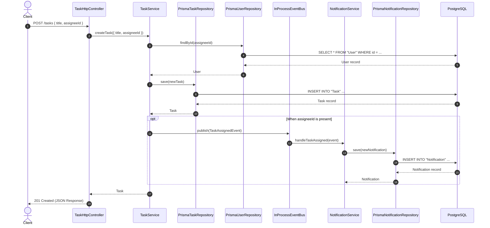

# TaskFlow Hexagonal Architecture - Component Diagram

## Overview
The Hexagonal Architecture (also known as **Ports and Adapters**, formalized by Alistair Cockburn) organizes the TaskFlow monolithic backend by strictly isolating core business logic from delivery mechanisms, frameworks, and infrastructure.

In this architecture, the application core (Domain Entities and Application Services) resides in the center of the hexagon. Outside dependencies interact with the core exclusively across explicit boundaries:
- **Driving (Primary / Inbound) Ports:** Expose domain use cases to external actors and driving adapters (e.g., Fastify HTTP REST controllers).
- **Driven (Secondary / Outbound) Ports:** Define SPI abstractions required by the domain core for data persistence, messaging, and secondary integrations.
- **Driven (Secondary / Outbound) Adapters:** Implement driven ports using concrete technologies (e.g., Prisma ORM and an in-process event bus), keeping the core framework-agnostic.

---

## Mermaid Component Diagram

```mermaid
flowchart TB
  Client["Client / Web Browser"]

  subgraph MonolithHexagon["TaskFlow Monolithic Application (Single Process)"]
    
    subgraph DrivingAdapters["Primary / Driving Adapters (HTTP Transport)"]
      UserHttp["User HTTP Controller<br/>(users.routes.ts)"]
      TaskHttp["Task HTTP Controller<br/>(tasks.routes.ts)"]
      NotifHttp["Notification HTTP Controller<br/>(notifications.routes.ts)"]
    end

    subgraph DrivingPorts["Driving / Inbound Ports (Use Case Interfaces)"]
      UserUseCasePort[["UserUseCasePort<br/>(IUserService)"]]
      TaskUseCasePort[["TaskUseCasePort<br/>(ITaskService)"]]
      NotifUseCasePort[["NotificationUseCasePort<br/>(INotificationService)"]]
    end

    subgraph HexagonalCore["Hexagonal Domain Core (Business Logic)"]
      subgraph DomainServices["Application & Domain Services"]
        UserService["UserService"]
        TaskService["TaskService"]
        NotifService["NotificationService"]
      end
      
      subgraph DomainEntities["Pure Domain Entities"]
        UserEntity["User Entity"]
        TaskEntity["Task Entity"]
        NotifEntity["Notification Entity"]
      end
    end

    subgraph DrivenPorts["Driven / Outbound Ports (SPI Interfaces)"]
      UserRepoPort[["UserRepositoryPort<br/>(IUserRepository)"]]
      TaskRepoPort[["TaskRepositoryPort<br/>(ITaskRepository)"]]
      NotifRepoPort[["NotificationRepositoryPort<br/>(INotificationRepository)"]]
      EventPubPort[["EventPublisherPort<br/>(IEventPublisher)"]]
    end

    subgraph DrivenAdapters["Secondary / Driven Adapters (Infrastructure)"]
      UserPrismaAdapter["Prisma UserRepository Adapter<br/>(prisma-user.repository.ts)"]
      TaskPrismaAdapter["Prisma TaskRepository Adapter<br/>(prisma-task.repository.ts)"]
      NotifPrismaAdapter["Prisma NotificationRepository Adapter<br/>(prisma-notification.repository.ts)"]
      EventBusAdapter["In-Process Event Bus Adapter<br/>(event-bus.adapter.ts)"]
    end

  end

  subgraph Database["PostgreSQL Database (taskflow)"]
    UserTable[("User Table")]
    TaskTable[("Task Table")]
    NotifTable[("Notification Table")]
  end

  %% Client to Driving Adapters
  Client -->|"HTTP POST/GET /users"| UserHttp
  Client -->|"HTTP POST/GET/PATCH /tasks"| TaskHttp
  Client -->|"HTTP GET/PATCH /notifications"| NotifHttp

  %% Driving Adapters to Inbound Ports
  UserHttp -->|"Invokes"| UserUseCasePort
  TaskHttp -->|"Invokes"| TaskUseCasePort
  NotifHttp -->|"Invokes"| NotifUseCasePort

  %% Inbound Ports Implemented by Core Services
  UserUseCasePort -.->|"Implemented by"| UserService
  TaskUseCasePort -.->|"Implemented by"| TaskService
  NotifUseCasePort -.->|"Implemented by"| NotifService

  %% Services use Entities
  UserService --- UserEntity
  TaskService --- TaskEntity
  NotifService --- NotifEntity

  %% Core Services depend on Outbound Ports (DIP)
  UserService -->|"Calls"| UserRepoPort
  TaskService -->|"Calls"| TaskRepoPort
  TaskService -->|"Calls"| UserRepoPort
  TaskService -->|"Publishes TaskAssignedEvent"| EventPubPort
  NotifService -->|"Calls"| NotifRepoPort

  %% Driven Adapters implement Outbound Ports
  UserPrismaAdapter -.->|"Implements"| UserRepoPort
  TaskPrismaAdapter -.->|"Implements"| TaskRepoPort
  NotifPrismaAdapter -.->|"Implements"| NotifRepoPort
  EventBusAdapter -.->|"Implements"| EventPubPort

  %% Event Bus routing within process
  EventBusAdapter -->|"Dispatches TaskAssignedEvent"| NotifUseCasePort

  %% Driven Adapters to DB
  UserPrismaAdapter -->|"SQL (Prisma Client)"| UserTable
  TaskPrismaAdapter -->|"SQL (Prisma Client)"| TaskTable
  NotifPrismaAdapter -->|"SQL (Prisma Client)"| NotifTable
```



---

## Architectural Analysis & Interactions

### 1. Architectural Layers & Boundaries

#### A. Primary / Driving Adapters (HTTP Transport)
- **Fastify Route Controllers:** Responsible strictly for HTTP protocol translation, request header parsing, schema validation, HTTP status code selection, and response serialization.
- **Independence:** The route controllers have no knowledge of database structures or SQL queries; they delegate all business orchestration directly to driving port contracts.

#### B. Driving (Inbound) Ports
- Defined as TypeScript interfaces in the core layer that capture domain use cases:
  - `UserUseCasePort`: `createUser(dto)`, `listUsers()`, `getUserById(id)`
  - `TaskUseCasePort`: `createTask(dto)`, `listTasks()`, `getTaskById(id)`, `assignTask(taskId, assigneeId)`
  - `NotificationUseCasePort`: `listUserNotifications(userId)`, `markAsRead(notificationId)`, `handleTaskAssigned(event)`

#### C. Hexagonal Domain Core
- **Pure Entities:** `User`, `Task`, and `Notification` models that encapsulate business properties and validation invariants.
- **Application Services:** `UserService`, `TaskService`, and `NotificationService` implement the driving ports. They contain domain business rules (e.g., verifying user existence before task creation or assignment) without any direct reference to Prisma, Fastify, or external libraries.

#### D. Driven (Outbound) Ports (Dependency Inversion Principle)
- SPI interfaces declared by the domain core to dictate what storage and messaging capabilities are required:
  - `UserRepositoryPort`: `save(user)`, `findAll()`, `findById(id)`, `findByEmail(email)`
  - `TaskRepositoryPort`: `save(task)`, `findAll()`, `findById(id)`, `updateAssignee(id, assigneeId)`
  - `NotificationRepositoryPort`: `save(notification)`, `findByUserId(userId)`, `findById(id)`, `update(notification)`
  - `EventPublisherPort`: `publish<T extends DomainEvent>(event: T)`

#### E. Secondary / Driven Adapters (Infrastructure)
- **Prisma Repositories:** Implement the repository ports by executing database operations via Prisma ORM against the centralized PostgreSQL instance.
- **In-Process Event Bus Adapter:** Implements `EventPublisherPort`. When a task is assigned, `TaskService` emits a `TaskAssignedEvent` through this port. The in-process event bus dispatches the event in-memory to `NotificationUseCasePort.handleTaskAssigned`, removing direct database cross-writes between the task and notification domains.

---

### 2. Interaction & Execution Workflows

#### Task Creation & Decoupled Notification Flow


---

### 3. Port & Adapter Interface Definitions

```typescript
// --- Driving (Inbound) Ports ---
export interface UserUseCasePort {
  createUser(dto: CreateUserDTO): Promise<User>;
  listUsers(): Promise<User[]>;
  getUserById(id: string): Promise<User | null>;
}

export interface TaskUseCasePort {
  createTask(dto: CreateTaskDTO): Promise<Task>;
  listTasks(): Promise<TaskWithAssignee[]>;
  getTaskById(id: string): Promise<TaskWithAssignee | null>;
  assignTask(taskId: string, assigneeId: string): Promise<Task>;
}

export interface NotificationUseCasePort {
  listUserNotifications(userId: string): Promise<Notification[]>;
  markAsRead(notificationId: string): Promise<Notification>;
  handleTaskAssigned(event: TaskAssignedEvent): Promise<void>;
}

// --- Driven (Outbound) Ports ---
export interface UserRepositoryPort {
  save(user: User): Promise<User>;
  findAll(): Promise<User[]>;
  findById(id: string): Promise<User | null>;
  findByEmail(email: string): Promise<User | null>;
}

export interface TaskRepositoryPort {
  save(task: Task): Promise<Task>;
  findAll(): Promise<TaskWithAssignee[]>;
  findById(id: string): Promise<TaskWithAssignee | null>;
  updateAssignee(id: string, assigneeId: string): Promise<Task>;
}

export interface NotificationRepositoryPort {
  save(notification: Notification): Promise<Notification>;
  findByUserId(userId: string): Promise<Notification[]>;
  findById(id: string): Promise<Notification | null>;
  update(notification: Notification): Promise<Notification>;
}

export interface EventPublisherPort {
  publish<T extends DomainEvent>(event: T): Promise<void>;
}
```

---

## Architectural Trade-Off Analysis

| Architectural Dimension | Layered Monolith | Hexagonal Monolith (Ports & Adapters) | Microservices | Serverless |
| :--- | :--- | :--- | :--- | :--- |
| **Coupling Model** | High coupling (HTTP handlers call DB client directly). | Low coupling (high-level policy depends only on port abstractions). | Decoupled by service network boundaries and message queues. | Decoupled by event router (EventBridge/SQS) and cloud functions. |
| **Testability in Isolation** | Hard: Requires booting Fastify server and PostgreSQL test database. | Exceptional: Domain services tested with fast in-memory stub adapters. | Requires stubbing HTTP services or running test containers with broker. | Requires cloud mocks or local runtime emulators. |
| **Framework Independence** | Low: Domain code is tightly intertwined with Fastify and Prisma types. | High: Core domain code is 100% vanilla TypeScript; frameworks are pluggable. | High per service, but bound to transport protocols. | High per function, but bound to cloud provider FaaS signatures. |
| **Operational Overhead** | Minimum: Single process, single DB, simple local dev. | Minimum: Single process, single DB, simple local dev, zero distributed complexity. | High: Multiple Docker containers, RabbitMQ broker, distributed logging. | Low-to-Medium: Zero server management; cloud monitoring needed. |
| **Refactoring / Migration Path** | High friction when extracting services due to tangled code. | Seamless: Driven adapters can be swapped to HTTP/gRPC/AMQP clients to extract microservices without touching domain core. | Already partitioned into autonomous services. | Granular serverless handlers. |
