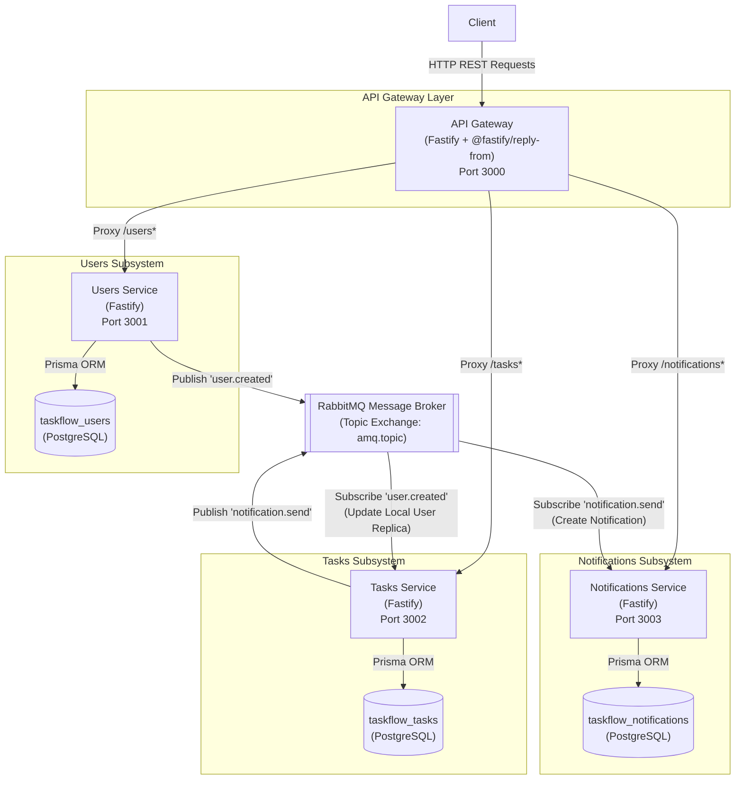

# TaskFlow Microservices - Component Diagram

## Overview
The microservices architecture decomposes TaskFlow into three autonomous services (`users-service`, `tasks-service`, and `notifications-service`) behind a unified API Gateway, communicating asynchronously via a RabbitMQ topic exchange.

## Mermaid Component Diagram

## Architectural Analysis & Interactions

### 1. API Gateway Layer (`api-gateway`)
- **Reverse Proxy Routing:** Uses `@fastify/reply-from` to proxy incoming client requests:
  - `/users*` $\rightarrow$ `users-service:3001`
  - `/tasks*` $\rightarrow$ `tasks-service:3002`
  - `/notifications*` $\rightarrow$ `notifications-service:3003`
- **Unified Ingress:** Clients interact exclusively with the gateway port `3000`, decoupling external consumers from internal network topology.

### 2. Autonomous Services & Database-per-Service
- **Users Service (`users-service`, Port 3001):**
  - Manages `User` entities in `taskflow_users`.
  - Publishes `user.created` event payload whenever a new user registers.
- **Tasks Service (`tasks-service`, Port 3002):**
  - Manages `Task` entities and local replica `User` cache in `taskflow_tasks`.
  - Consumes `user.created` messages to maintain referential integrity without cross-database queries.
  - Publishes `notification.send` event payload when a task is created or assigned with an `assigneeId`.
- **Notifications Service (`notifications-service`, Port 3003):**
  - Manages `Notification` entities in `taskflow_notifications`.
  - Consumes `notification.send` messages from RabbitMQ and persists notification records asynchronously.

### 3. Asynchronous Messaging & Decoupling
- **RabbitMQ Topic Exchange (`amq.topic`):**
  - Decouples task mutations from notification persistence.
  - If `notifications-service` experiences downtime or high latency, task creation and assignment succeed immediately; notification events queue safely in RabbitMQ.
