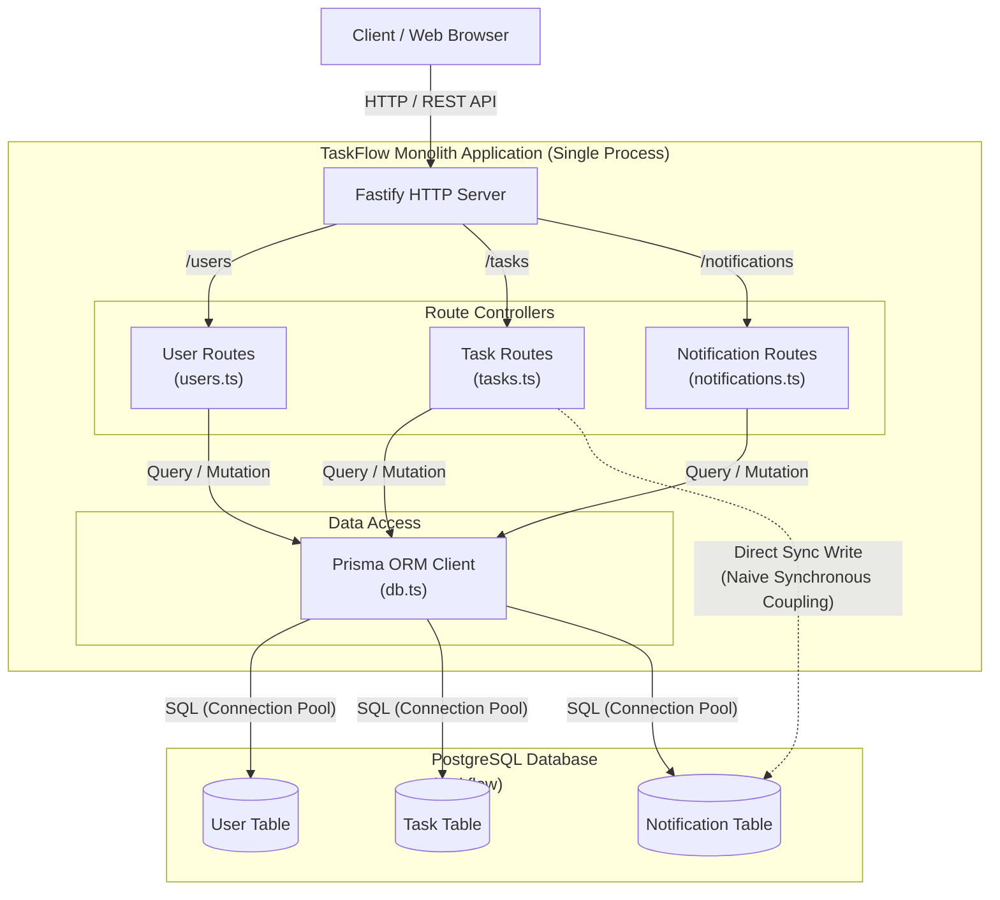

# TaskFlow Monolith - Component Diagram

## Overview
The Monolithic architecture packages all TaskFlow capabilities (User Management, Task Management, and Notifications) into a single Fastify application running in a single Node.js process with a single PostgreSQL database.

## Mermaid Component Diagram

## Architectural Analysis & Interactions

### 1. Unified Process & Memory Model
- **Single Process Execution:** All routes and controllers (`users`, `tasks`, `notifications`) execute inside the same Node.js runtime and Fastify server instance.
- **Shared Memory & Heap:** Application state, connection pools, and runtime dependencies are shared across domains.

### 2. Route Controllers & Endpoints
- `UserRoutes` (`/users`): Handles user registration (`POST /users`), user retrieval (`GET /users`), and single user lookup (`GET /users/:id`).
- `TaskRoutes` (`/tasks`): Handles task creation (`POST /tasks`), listing (`GET /tasks`), details (`GET /tasks/:id`), and task assignment (`PATCH /tasks/:id/assign`).
- `NotificationRoutes` (`/notifications`): Handles retrieving user notifications (`GET /notifications/:userId`) and marking notifications as read (`PATCH /notifications/:id/read`).

### 3. Data Access & Synchronous Coupling
- **Shared Prisma Client:** A single `PrismaClient` instance manages connection pooling and query execution to the centralized PostgreSQL instance (`taskflow`).
- **In-Band Synchronous Notification Creation:** When a task is created or assigned with an `assigneeId`, `TaskRoutes` executes a direct synchronous insert to the `Notification` table within the same HTTP request lifecycle. A failure or delay in notification writing directly impacts task assignment latency and availability.
