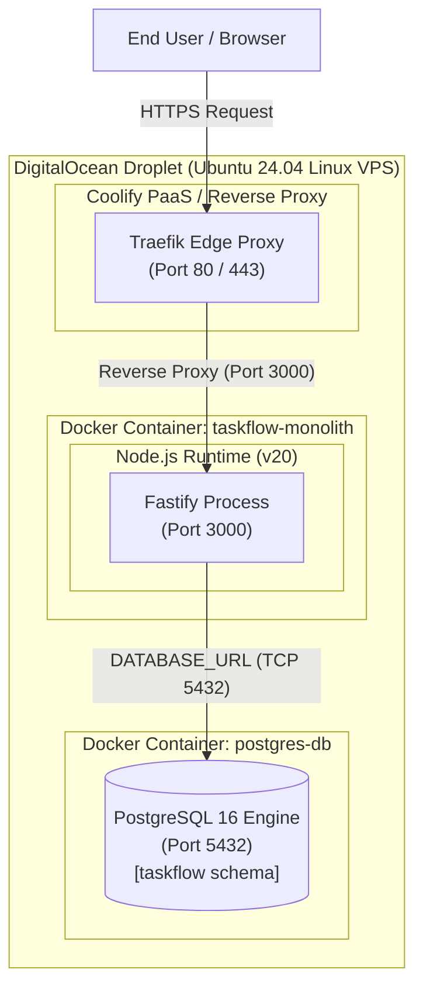

# TaskFlow Monolith - Deployment Diagram

## Overview
The monolithic architecture is deployed as a single containerized application managed by Coolify on an Ubuntu Linux VPS (DigitalOcean Droplet), connecting to an attached PostgreSQL database container.

## Mermaid Deployment Diagram

## Infrastructure Topology & Configuration

### 1. Host Node
- **Virtual Private Server:** DigitalOcean Droplet running Ubuntu 24.04 LTS (4 vCPU / 8 GB RAM).
- **Coolify PaaS:** Orchestrates Docker container builds, environment variables, health checks, and deployment lifecycles.

### 2. Edge & Networking Layer
- **Reverse Proxy:** Traefik manages TLS termination (Let's Encrypt SSL/TLS on port 443) and routes incoming HTTP/HTTPS traffic to the container.
- **Port Bindings:**
  - Fastify listens internally on port `3000`.
  - Postgres listens internally on port `5432`.
  - Traefik exposes public ports `80` (HTTP) and `443` (HTTPS).

### 3. Environment & Secrets
- `PORT=3000`: Fastify listening port.
- `DATABASE_URL`: Connection string formatted as `postgresql://postgres:<password>@postgres-db:5432/taskflow?schema=public`.
