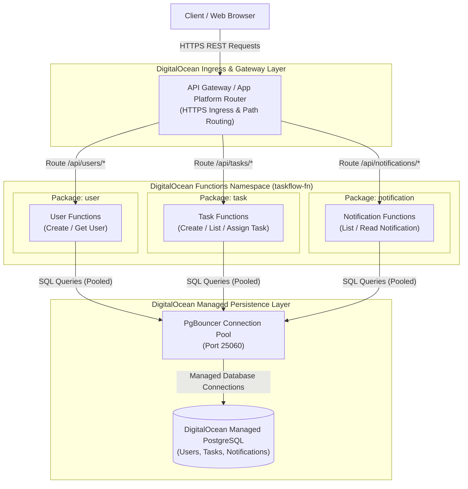

# TaskFlow Serverless - Component Diagram

## Overview
The serverless architecture decomposes TaskFlow into modular, lightweight Function-as-a-Service (FaaS) execution units hosted on **DigitalOcean Functions**, orchestrated through an API gateway/ingress layer and persisting state to a DigitalOcean Managed PostgreSQL database.

## Mermaid Component Diagram

## Architectural Analysis & Interactions

### 1. DigitalOcean Ingress & API Routing
- **HTTP Routing & Ingress:** Client requests enter via DigitalOcean API Gateway / App Platform routing or direct Functions Web Action endpoints (`https://faas-<region>.doserverless.co/api/v1/web/<namespace>/...`).
- **Route Definitions:**
  - `ANY /api/users/*` $\rightarrow$ `user` package functions
  - `ANY /api/tasks/*` $\rightarrow$ `task` package functions
  - `ANY /api/notifications/*` $\rightarrow$ `notification` package functions

### 2. Ephemeral Compute Units (DigitalOcean Serverless Functions)
- **Granular Serverless Packages:** Functions are deployed into logical packages (`user`, `task`, `notification`) running on Node.js runtime environments (`nodejs:20`).
- **On-Demand Elastic Execution:** Functions scale from zero on demand, executing statelessly during HTTP request lifecycles without persistent server overhead.
- **Synchronous Execution Model:** User, task, and notification operations execute synchronously via respective function actions, maintaining independent failure isolation per endpoint.

### 3. Managed Persistence & Connection Pooling
- **Managed PostgreSQL Database:** Persistent relational storage for `User`, `Task`, and `Notification` domain entities.
- **PgBouncer Connection Pooling:** Because serverless functions scale horizontally and rapidly spin up concurrent ephemeral instances, incoming connections are routed through an integrated PgBouncer connection pool to prevent database connection exhaustion.
