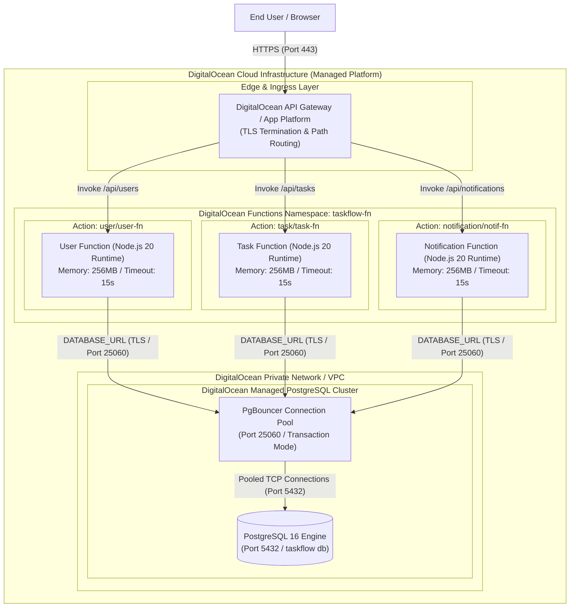

# TaskFlow Serverless - Deployment Diagram

## Overview
The serverless architecture is deployed onto DigitalOcean's managed cloud infrastructure using **DigitalOcean Functions** (FaaS) organized within a serverless namespace, routing traffic through DigitalOcean API Gateway / Ingress and connecting to a **DigitalOcean Managed PostgreSQL Database** with an integrated PgBouncer connection pool over a secure private network.

## Mermaid Deployment Diagram

## Infrastructure Topology & Configuration

### 1. Serverless Compute Platform (DigitalOcean Functions)
- **Functions Namespace:** Dedicated namespace (`taskflow-fn`) deployed and managed using the `doctl serverless` CLI with `project.yml` configuration.
- **Runtime Environment:** Node.js 20 runtime (`nodejs:20`) with configurable memory limits (256MB) and execution timeouts (15s).
- **Auto-Scaling:** Automatically scales from 0 to meet concurrent request volume with zero idle compute costs.

### 2. Edge & Networking Layer
- **Ingress & TLS:** DigitalOcean API Gateway / App Platform provides automated TLS termination (HTTPS port 443) and routes public endpoints to the corresponding function actions:
  - `/api/users/*` $\rightarrow$ `packages/user/user-fn`
  - `/api/tasks/*` $\rightarrow$ `packages/task/task-fn`
  - `/api/notifications/*` $\rightarrow$ `packages/notification/notif-fn`
- **Functions Web Endpoints:** Alternatively accessible directly via secure DigitalOcean Web Action URLs (`https://faas-<region>.doserverless.co/api/v1/web/<namespace>/...`).
- **Private Network (VPC):** Function instances communicate securely with the database over DigitalOcean's private VPC network with SSL/TLS enforcement.

### 3. Managed Persistence & Connection Pooling
- **DigitalOcean Managed Database:** Managed PostgreSQL 16 cluster with automated backups, high availability, and failover support.
- **Connection Pool (PgBouncer):** Functions connect to PgBouncer on port `25060` (Transaction pooling mode) to multiplex and manage database connections, mitigating connection starvation caused by ephemeral, concurrent serverless invocations.

### 4. Environment & Secrets
- `DATABASE_URL`: Connection pool string formatted as `postgresql://<user>:<password>@<db-pool-host>:25060/taskflow?sslmode=require`.
- Environment secrets and function configurations are managed securely via `project.yml` and DigitalOcean Functions encrypted namespace parameters.
